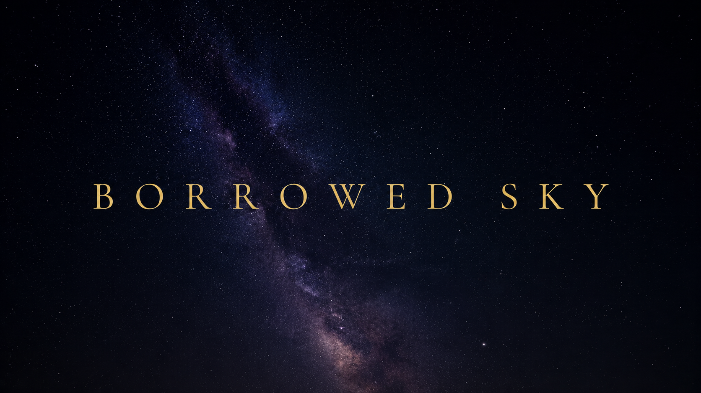

<div align="center">



**A zero-install sky companion that tells anyone, anywhere, what is overhead right now, and explains it like a patient guide.**

[](https://www.ibm.com/products/watsonx-ai)
[](https://www.ibm.com/granite)
[](https://bob.ibm.com/)


### [Open the live app](https://borrowed-sky.vercel.app/)

No install, no account, no sign-in. It asks for your location and shows you your own sky.

*Built for the **AI Builders Challenge with IBM Bob**, Space Exploration theme.*

</div>

---

Open it in a browser. Point your phone up. It names what you are looking at, computed for the exact spot you are standing on and the exact minute it is.

Two links worth having open: the [live app](https://borrowed-sky.vercel.app/), and the same app [held at a moonlit night](https://borrowed-sky.vercel.app/?at=2026-09-27T19:40:51Z), where the fitted sky model has something to do.

No install. No account. No telescope. No prior knowledge.

### Contents

| | |
|---|---|
| [The problem](#the-problem) | who this is actually for |
| [What it does](#what-it-does) | the six things it is |
| [IBM technology in this project](#ibm-technology-in-this-project) | Granite, watsonx.ai, Bob, at a glance |
| [Nothing is fabricated](#the-core-principle-nothing-is-fabricated) | the rule that shaped every decision |
| [Built with IBM Bob](#built-with-ibm-bob) | the three briefs Bob owned, and what came out of them |
| [The AI layer](#the-ai-layer-ibm-granite-on-watsonxai) | what Granite does and is forbidden from doing |
| [The sky model](#machine-learning-a-sky-model-fitted-to-170000-human-observations) | ML fitted to 170,000 human observations |
| [Verification](#verification) | how the astronomy is proved |
| [Running it](#running-it) | five minutes, no credentials needed |
| [Privacy and security](#privacy-and-security) | what leaves your device, and what does not |
| [Honest limitations](#honest-limitations) | what it deliberately does not do |

Deeper detail lives beside the code: [running and deploying](docs/RUNNING.md) · [verification](docs/VERIFICATION.md) · [design notes](docs/DESIGN-NOTES.md) · [engineering log](docs/ENGINEERING-LOG.md)

---

## The problem

A third of the world cannot see the Milky Way from home. The harder problem is that even under a perfect sky, most people have no idea what they are looking at.

The tools that fix this assume you are already an enthusiast: an install, a capable phone, and a user who knows the name of the thing they are hunting. That excludes exactly the people a first look would matter most to.

**Borrowed Sky is for someone who has never used an astronomy tool and does not know what a magnitude is.** It says what is up there, where to look, and when to go outside.

---

## What it does

| | |
|---|---|
| **Live sky map** | Turns as you turn. Real catalogue, the Milky Way where the galaxy actually is, afterglow on the bearing the Sun actually set. Tap anything. |
| **Compass repeater** | A brass heading strip, and the proof tracking is live: when the compass drives, the card turns. |
| **Tonight** | What actually becomes visible over the coming hours, plotted over the real Sun altitude. |
| **A guide you can ask** | *"What's that bright one?"* answered from the computed sky. *Explain like I'm 10* changes the words, never the facts. |
| **Sky journal** | What you have found, filling in a planisphere. On your device, nothing uploaded. |
| **Night vision** | Red-only, sky canvas included. A bright screen costs you twenty minutes of dark adaptation. |

---

## IBM technology in this project

| What | Where it is used | Why it is there |
|---|---|---|
| **IBM Granite** (`granite-3-3-8b-instruct`) on **watsonx.ai** | Every explanation, every answer in the guide | Understands an untrained question and chooses what is worth saying. It is given a finished JSON description of the sky and forbidden from adding to it. |
| **IBM Granite Embeddings** (`granite-embedding-30m`, 384-d) | Retrieval over the project's own reference corpus | Lets the guide cite where an explanation came from instead of asserting it |
| **IBM Bob** | The grounding guard, the sky model's controls, and two goes at the model itself | Agentic development against written briefs with acceptance criteria, planning and testing on its own |
| **watsonx.ai tool calling** | The guide's access to the live sky | Granite may call functions that answer out of the browser's own astronomy engine, so a request for a position is computed rather than recalled |

Granite carries the language. It never carries the correctness: every number it speaks has already been computed in the browser, and a guard checks each answer against that data before it is shown.

---

## Built with IBM Bob

Three briefs handed to [IBM Bob](https://bob.ibm.com/) to plan, write, test and iterate on its own.

| brief | outcome |
|---|---|
| **The grounding guard** | Shipped. The check that gates every Granite answer against the computed sky and refuses to show an unsupported claim. |
| **The sky model** | Two attempts against Globe at Night data. Neither shipped, and diagnosing why produced the finding below. |
| **The model's controls** | Shipped. An on/off switch and a pinned-instant link, both with exact-equality proofs. |

Bob made two calls better than the brief. It kept timestamps out of the pool of numbers the guard scans, because digits scraped from an ISO date give false claims accidental cover. And it documented that the guard pools every value regardless of what that value measures, so the check reads as exactly as tight as it is.

> **The finding this project is proudest of.** The Globe at Night export has its timezone offsets applied backwards. Derive a Sun altitude from the published UT columns and **53.1%** of naked-eye star chart observations land in daylight, which cannot happen. Derive it from the local clock and the longitude and that falls to **7.7%**. Half the training set was wrong by twelve hours, so the Sun coefficient was fitted through noise and came out near zero. Anyone fitting anything to that dataset needs to know.

The version that ships was written outside Bob. What changed was not the arithmetic but the shape.

The development record in full: **[docs/ENGINEERING-LOG.md](docs/ENGINEERING-LOG.md)**

---

## The core principle: nothing is fabricated

**No mock data anywhere, including during development.** No placeholder sky. If a source is unavailable the app states the failure rather than filling the gap.

| what | from |
|---|---|
| 5,070 stars | HYG v4.1, J2000 astrometry. Colours from each star's B-V index, not picked by hand |
| The Milky Way | the real galactic frame, from the IAU pole |
| The afterglow | the Sun's computed azimuth, so it points where the Sun actually set |
| Sun, Moon, planets | astronomy-engine, apparent positions with aberration and refraction |
| Satellite passes | SGP4 on live Celestrak elements, searched numerically rather than looked up |
| Explanations | NASA's public-domain writing, retrieved by embedding and cited |
| Granite | receives a finished sky and adds nothing to it |

**Three things are not computed, and each is fenced.** Place names are looked up, so the coordinate is rounded to about a kilometre first and nothing is invented when it fails. The foreground hills are drawn, so they are clipped strictly below the true horizon and can never sit in front of a real object. Explanations come from the corpus rather than memory, so retrieval refuses rather than degrading when it cannot match. Why each is fenced that way: **[docs/DESIGN-NOTES.md](docs/DESIGN-NOTES.md)**

### Visible is not the same as above the horizon

A satellite overhead is invisible in Earth's shadow; a planet is invisible in a bright sky. A pass counts as *visible* only when the satellite is sunlit **and** the sky is dark **and** it clears 10 degrees. The same question about stars is what [the sky model](#machine-learning-a-sky-model-fitted-to-170000-human-observations) answers.

### Verification

The astronomy is checked against sources independent of the code, not against itself.

```bash
npm run verify      # 14 checks: astronomy, tools, retrieval, the sky model
npm run verify:ui   # 5 headless-Chrome passes over the real app
```

| check | measured against | result |
|---|---|---|
| Coordinate frames | astronomy-engine's own independent path | agree to **0.01 arcseconds** |
| Galactic frame | published position of Sagittarius A\* | **0.1 arcseconds** |
| Satellites | ISS period, orbital speed, sunlit fraction | derived independently of the code |
| Timeline | Svalbard in midsummer, where the answer is "no darkness tonight" | four latitudes |
| The sky model | held-out observations it never saw | **8.3%** better than a constant |
| The guide, with watsonx failing | six ways it can fail, including hanging | answers from the computed sky every time |

What each check covers and why several of them exist: **[docs/VERIFICATION.md](docs/VERIFICATION.md)**


## Architecture

Positions are computed in the browser from geolocation and the current time, turned into a structured object list, and only then handed to the AI layer. Device orientation selects which part of that computed sky is drawn. Two serverless functions exist only to hold keys and to proxy services that send no CORS header.

<details>
<summary>Project layout</summary>

```
Browser
├── public/data/           Star + constellation catalogues (static, cacheable)
├── src/lib/astro/
│   ├── frames.ts          Coordinate frames; collapses the whole transform
│   │                      chain into one 4×3 matrix per frame
│   ├── starfield.ts       Catalogue loading into typed arrays
│   ├── solar.ts           Sun/Moon/planet ephemeris
│   ├── satellites.ts      TLE parsing, SGP4, eclipse test, pass search
│   ├── milkyway.ts        Galactic frame; places the band on the real sky
│   └── events.ts          Tonight's visibility windows
├── src/lib/ai.ts          Context builder + deterministic fallback narrator
└── src/components/        Sky canvas, timeline, guide, journal

Server (serverless functions)
├── api/tle.ts             Celestrak proxy, Celestrak sends no CORS header,
│                          so a browser cannot reach it directly
└── api/ask.ts             watsonx.ai proxy, keeps the API key off the client
```

</details>

**Why the sky map is fast.** Placing 5,000 stars the obvious way is too slow on the cheap hardware this is meant for, so the whole chain from J2000 to screen collapses into a single 4x3 matrix rebuilt once per frame: twelve multiplies per star and no trigonometry. Stars batch into colour buckets, so the renderer issues one fill per bucket rather than one per star. Stereographic projection maps every circle on the sphere to a circle in the plane, so the horizon and each layer beneath it is solved analytically instead of walked point by point.

---

## The AI layer: IBM Granite on watsonx.ai

Narration runs on **IBM watsonx.ai** with **IBM Granite**. `api/ask.ts` walks a short list of Granite models, since which ones a project can call depends on its region and plan.

**Granite does language, never astronomy.** Every position, time, magnitude and phase is computed in the browser first; only a finished JSON description of that sky reaches the model.

> The JSON block you are given is the ONLY authoritative description of this observer's sky. Never state a position, altitude, direction, time, distance or brightness that is not present in that JSON. If you are asked something the JSON does not answer, say plainly that you cannot see it in tonight's data. Never guess.

That leaves it the part no template covers: working out which object *that bright one* means, choosing which two of a dozen matter to someone with no telescope, and saying *I can't see that in tonight's data* rather than reaching into training data.

**When Granite is unavailable the app does not go quiet and does not guess.** A deterministic narrator assembles sentences from the same computed values, and the interface names which of the two spoke. Six failure modes are tested, including the endpoint hanging; all six still answer from the computed sky.

---

## Machine learning: a sky model fitted to 170,000 human observations

Granite is the language layer. This is the part that learned something.

The app decides what is visible from four hand-written thresholds keyed on the Sun. They are right about the biggest thing that happens to a sky and silent about the next two: **the Moon**, and **light pollution**.

[Globe at Night](https://globeatnight.org/) has the data. Since 2006, about 170,000 people have stood outside and reported which of eight star charts matched what they could actually see. Least squares on 121,998 of them, held out chronologically on the most recent 21,530.

| term | effect |
|---|---|
| a full Moon overhead | **0.794** chart steps of sky lost |
| each step of local dark-sky median | **0.737** |
| each kilometre of elevation | **0.141** |

Held-out error **1.4977**, against **1.6327** for guessing the average every time. **8.3% better**, on the same scale, with nothing converted.

**The decision that made it work.** It returns a *correction*, never an answer: magnitudes to add to a limit the caller already has. It was fitted only on observations with the Sun below -18 degrees and is applied only there. Above that it returns exactly zero, so daylight runs code identical to what ran before the model existed. Daylight cannot regress, because the model cannot reach it. Two earlier versions replaced the thresholds outright and both listed Sirius as visible at noon.

In the app it is worth up to about 0.7 magnitudes. Faint stars fade as the Moon rises, a city sky draws thinner than a field, and Settings has a switch to turn it off and watch them come back.

**How it is checked.** One check asserts that for every brightness from magnitude -5 to +7, at seven Sun altitudes above -18, asking with the model gives an identical answer to asking without it. Another drives the real app in headless Chrome and blocks the model file at the network layer for a control run: same night, same Moon, same stars overhead, **838 points of light with the model against 882 without**.

---

## Running it

Works with no credentials. The astronomy is computed in your browser; the guide falls back to its deterministic narrator. Adding watsonx credentials swaps in IBM Granite and changes nothing else.

```bash
npm install
npm run catalog     # star + constellation data into public/data
npm run dev         # http://localhost:5173
```

Full setup, watsonx credentials and Vercel deployment: **[docs/RUNNING.md](docs/RUNNING.md)**

---


## Addressing the Space Exploration theme

Three genuinely complex sources, a star catalogue in J2000 equatorial coordinates, a planetary ephemeris, and SGP4 orbital elements, turned into a sentence a ten-year-old can act on:

> *Go outside at 7:42, look low in the west. That moving point is a space station with people aboard it.*

The translation is the product, and it is aimed at people on the wrong side of the line: no telescope, no app store, no background knowledge, possibly a borrowed phone. Hence the name.

---

## Privacy and security

The app asks for one thing about you. The design question was how little of it can leave.

| | |
|---|---|
| Your position | Rounded to about a kilometre before it ever leaves. The town, not the street. |
| The sky | Computed in your browser. Even the AI's lookups run there, so no server works out a position about you. |
| What leaves | One request: a rounded coordinate, for a place name and a timezone. The landing page says so before you are asked. |
| Where it is kept | `localStorage`, via the browser's own permission prompt. Never a cookie, never a URL. |
| The watsonx key | Server-side only. Not in the bundle, not in any `VITE_` variable. |
| Endpoints that spend | Check origin and rate limit *before* the IAM exchange, so a refused request costs nothing. |

**This is not authentication and does not pretend to be.** The origin allowlist stops another site putting this app's AI behind its own page. It does nothing about a caller that is not a browser, and [`guard.check.ts`](scripts/verify/guard.check.ts) asserts that hole deliberately, so a green tick cannot be read as a stronger claim than the code makes. Full reasoning: **[docs/DESIGN-NOTES.md](docs/DESIGN-NOTES.md)**

## What it does not do

No AR camera overlay: locking labels to a live image needs sensor precision the browser cannot deliver, and a flaky AR mode would undermine the part that works. Pass predictions cover the ISS and Tiangong, since a full search over every bright satellite would be too slow on a cheap phone. And the browser compass is less precise than a native one, so where it drifts the app says so and offers a correction rather than claiming an accuracy it does not have.

The rest, including what each trade-off cost and why: **[docs/DESIGN-NOTES.md](docs/DESIGN-NOTES.md)**

---

## Credits and licences

Star astrometry from HYG v4.1, constellation figures from d3-celestial, ephemeris from astronomy-engine, SGP4 from satellite.js, orbital elements from Celestrak, place names from Nominatim, timezones from Open-Meteo, narration from IBM Granite on watsonx.ai. Planet and Moon portraits are public-domain spacecraft photographs, never drawings.

<details>
<summary>Every source, with its licence</summary>

- [HYG Database v4.1](https://github.com/astronexus/HYG-Database), star astrometry, CC BY-SA 4.0
- [d3-celestial](https://github.com/ofrohn/d3-celestial), constellation figures, BSD-3-Clause
- [astronomy-engine](https://github.com/cosinekitty/astronomy), ephemeris, MIT
- [satellite.js](https://github.com/shashwatak/satellite-js), SGP4, MIT
- [Celestrak](https://celestrak.org/), orbital elements, free and keyless
- [Nominatim](https://nominatim.openstreetmap.org/) on OpenStreetMap data, place names, ODbL, free and keyless
- [Open-Meteo](https://open-meteo.com/), the IANA timezone at a coordinate, CC BY 4.0, free and keyless
- [IBM Granite](https://www.ibm.com/granite) on [watsonx.ai](https://www.ibm.com/products/watsonx-ai), narration, Apache 2.0 model family
- The Sun, the planets and the Moon are photographs, not drawings. Every portrait in the
  object column, the dossier and the guide panel is a spacecraft image, cut out
  of its frame by `scripts/fetch-bodies.mjs` and stored with its provenance in
  `public/bodies/credits.json`. All are public domain; the script refuses to
  ship anything that is not, because cropping a share-alike image would put a
  licence condition on this repository that nobody reading the code would find.
  <details>
  <summary>Every portrait, with its source and licence</summary>

  - Sun — [SDO 20240810 000000 4096 HMIIC (HMI).jpg](https://commons.wikimedia.org/wiki/File:SDO_20240810_000000_4096_HMIIC_(HMI).jpg), NASA/SDO and the AIA, EVE and HMI science teams. Public domain. HMI's continuum intensitygram, which is the photosphere in visible light; the extreme ultraviolet channels SDO is better known for are false colour by necessity, and on a page that promises nothing is invented those would have been the wrong picture.
  - Mercury — [Mercury in color - Prockter07-edit1.jpg](https://commons.wikimedia.org/wiki/File:Mercury_in_color_-_Prockter07-edit1.jpg), National Aeronautics and Space Administration / Johns Hopkins University Applied Physics Laboratory / Carnegie Institution of Washington. Public domain.
  - Venus — [Venus globe.jpg](https://commons.wikimedia.org/wiki/File:Venus_globe.jpg), NASA/JPL. Public domain.
  - Moon — [Moon nearside LRO.jpg](https://commons.wikimedia.org/wiki/File:Moon_nearside_LRO.jpg), NASA/GSFC/Arizona State University. Public domain.
  - Mars — [Mars Valles Marineris.jpeg](https://commons.wikimedia.org/wiki/File:Mars_Valles_Marineris.jpeg), NASA / USGS (PIA04304). Public domain.
  - Jupiter — [Jupiter and its shrunken Great Red Spot.jpg](https://commons.wikimedia.org/wiki/File:Jupiter_and_its_shrunken_Great_Red_Spot.jpg), NASA, ESA, and A. Simon (Goddard Space Flight Center). Public domain.
  - Saturn — [Saturn (planet) large.jpg](https://commons.wikimedia.org/wiki/File:Saturn_(planet)_large.jpg), Voyager 2. Public domain.
  - Uranus — [Uranus2.jpg](https://commons.wikimedia.org/wiki/File:Uranus2.jpg), NASA/JPL-Caltech. Public domain.
  - Neptune — [Neptune Full.jpg](https://commons.wikimedia.org/wiki/File:Neptune_Full.jpg), NASA. Public domain.

  </details>

  Stars and satellites are deliberately *not* photographed. A star has no disc
  you could resolve from the ground, and a satellite overhead is a moving point
  of light; both get a drawn point in a sighting ring, which is what they are.

  The Sun is photographed on the sky chart and drawn on the landing page. On the
  chart it is an object being pointed at, like the planets beside it. On the
  landing page nothing is being pointed at anything and the Sun is the light the
  scene is lit by, where a photograph of a disc pasted into a gradient reads as a
  sticker rather than as a source.

- The Royal Observatory on the landing page is derived from [*Flamsteed House, Royal Observatory, Greenwich, London*](https://commons.wikimedia.org/wiki/File:Flamsteed_House,_Royal_Observatory,_Greenwich,_London,_20260719_0921_4494.jpg) by Jakub Hałun, CC BY 4.0, via Wikimedia Commons. The sky is cut out of it column by column and the remainder pushed towards a silhouette, so the photograph contributes a building and never a sky
- Typefaces: Cormorant Garamond, Unbounded and Share Tech Mono (Google Fonts)

</details>
